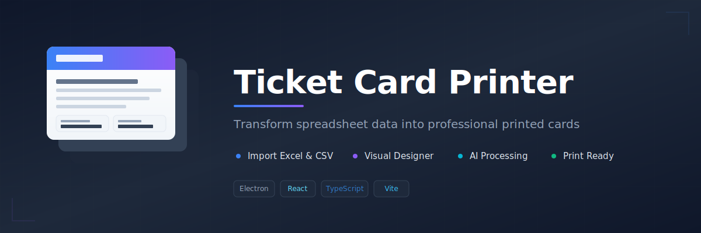

# Ticket Card Printer

A desktop application for designing and printing custom ticket/card layouts from Excel and CSV data, with AI-powered field processing.



## Features

- **Import Data** - Load ticket data from Excel (.xlsx, .xls, .xlsm) or CSV files
- **Visual Card Designer** - Drag-and-drop interface to arrange fields on cards
- **Conditional Styling** - Apply colors and backgrounds based on field values
- **Data Enrichment** - Add custom fields grouped by any column value
- **AI Integration** - Transform field values using Ollama, LM Studio, or OpenRouter
- **Template System** - Save, load, and share card designs
- **Print Ready** - Export to PDF with half-A4 or full-A4 layouts

## Getting Started

### Prerequisites

- [Node.js](https://nodejs.org/) (v18 or higher)
- npm (included with Node.js)

### Installation

```bash
# Clone the repository
git clone <repository-url>
cd "Tickets speos app"

# Install dependencies
npm install
```

### Running the Application

**Development Mode (with hot reload):**
```bash
npm run dev
```
Then open http://localhost:5173 in your browser.

**Electron Desktop App:**
```bash
npm run electron:dev
```

**Production Build:**
```bash
npm run electron:build
```
The packaged application will be in the `dist/` folder.

## Usage

1. **Upload Data** - Drag and drop an Excel or CSV file onto the upload area
2. **Select Fields** - Choose which columns to display on your cards
3. **Design Layout** - Drag fields to position them, resize as needed
4. **Style Cards** - Set fonts, colors, and conditional formatting rules
5. **Add Enrichments** - Create custom fields for specific groups
6. **Preview & Print** - Switch to Print tab, select size, and print (Ctrl/Cmd+P)

## AI Configuration

To use AI features, configure a provider in the AI Chat panel:

| Provider | Setup |
|----------|-------|
| **Ollama** | Install [Ollama](https://ollama.ai), run a model locally |
| **LM Studio** | Install [LM Studio](https://lmstudio.ai), start local server |
| **OpenRouter** | Get API key from [OpenRouter](https://openrouter.ai) |

## License

MIT
